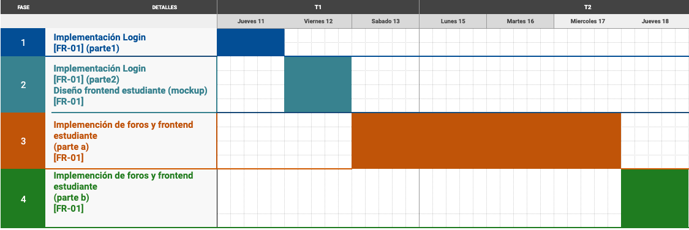
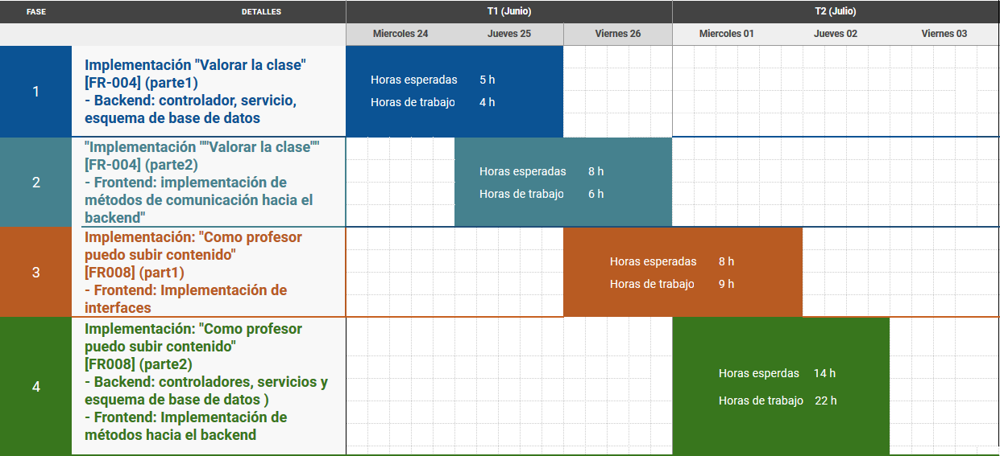

# SideProject - Entregable 2: Etapa de Diseño ([ver mas](#diagramas))

|  **#** | **Código** | **Apellidos, Nombre** | **% Trabajo** |
| :---: | :---: | :---: | :---: |
|  1 | 201810546 | Motta Paz, Angel | 20% |
|  2 | 201810554 | Barreto Zavaleta, Jeanlee | 20% |
|  3 | 201810010 | Lazo Pampa, David | 20% |
|  4 | 201810516 | Morales Alcalde, Piero | 20% |
|  5 | 201710418 | Cupe Guerrero, Carlos | 20% |

## Sprint 1

## Sprint 2

## Contenido
### [Glosario](docs/glossary.md)
### Lista de Requerimientos 
#### Requerimientos Funcionales Must-Have
1. FR-01 [#1](/../../issues/1)
2. FR-03 [#3](/../../issues/3)
3. FR-04 [#4](/../../issues/4)
4. FR-05 [#5](/../../issues/5)
5. FR-07 [#7](/../../issues/7)
6. FR-08 [#8](/../../issues/8)
7. FR-09 [#9](/../../issues/9)
8. FR-10 [#10](/../../issues/10)

#### Requerimientos Funcionales Nice-to-Have
1. FR-02 [#2](/../../issues/2)
2. FR-06 [#6](/../../issues/6)

#### Requerimientos No Funcionales
1. NFR-01 [#11](/../../issues/11)
2. NFR-02 [#12](/../../issues/12)
3. NFR-03 [#13](/../../issues/13)
4. NFR-04 [#14](/../../issues/14)
5. NFR-05 [#15](/../../issues/15)

### Resultados de las Técnicas de Recolección de Requerimientos
1. [Entrevista](docs/analysis/entrevista.md)
2. [Encuesta](docs/analysis/encuesta.md)

### Casos de Uso / Use Case
1. [UC-01 Descargar contenido](docs/analysis/UC01.md)
2. [UC-02 Subir contenido propio](docs/analysis/UC02.md)
3. [UC-03 Seleccionar tags de tópicos específicos](docs/analysis/UC03.md)
4. [UC-04 Adjuntar contenido multimedia](docs/analysis/UC04.md)
5. [UC-05 Adjuntar quices en videos](docs/analysis/UC05.md)
6. [UC-06 Visualizar los cursos más visitados](docs/analysis/UC06.md)
7. [UC-07 Revisar contenido](docs/analysis/UC07.md)
8. [UC-08 Buscar contenido](docs/analysis/UC08.md)
9. [UC-09 Calificar de contenido](docs/analysis/UC09.md)
10. [UC-10 Agregar vídeo existente](docs/analysis/UC10.md)
11. [UC Diagram](docs/analysis/UC_Diagram.md)

### Diagramas
1. [Diagrama de Arquitectura](docs/design/arquitectura.md)
2. [Diagrama de Componentes](docs/design/componentes.md)
3. [Diagrama de Clases](docs/design/clases.md)
4. [Diagrama de Secuencias](docs/design/secuencia.md)

### Presentation / Presentación
1. [Presentación Etapa de Análisis](docs/analysis/presentation.pdf)
2. [Presentación Etapa de Diseño](docs/design/presentation.pdf)
