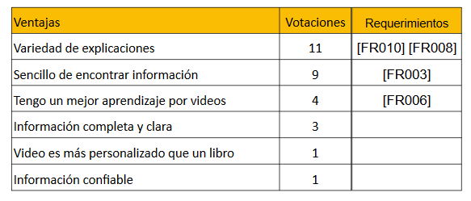

# Desarrollo de encuestas
Realizamos una encuesta, donde pudimos contactar a una muestra de 54 estudiantes con las siguientes características.
## Estudiantes por año escolar

## Estudiantes por ubicación

## Estudiantes por tipo de escuela

## ¿Que tan bueno consideran su señal de internet?
Donde 1 es malo y 5 es muy bueno

## ¿Que tipo de cursos te gustan más?

## ¿Cual consideras que es tu desempeño academico?
Donde 1 es bajo y 5 representa excelente.

## ¿Cuanto tiempo te toma buscar información?

## Cuando necesitas ayuda ¿Qué recursos utilizas?

## Preguntas abiertas
Hemos revisado las respuestas de los estudiantes y categorizado las respuestas en común, tal como se muestra a continuación.
## ¿Ventajas del recurso que utilizas?

## ¿Desventajas del recurso que utilizas?

## Sugerencias para nuestra aplicación

## De las siguientes caracteristicas ¿Cuáles crees que serían de mayor utilidad para tus estudios?

### Enlace de encuesta
https://docs.google.com/forms/d/e/1FAIpQLSfwytzqHz_t7Qb1DV5jc0lgrL002P2ZL9sWwPzFTkGS37ke8Q/viewform

